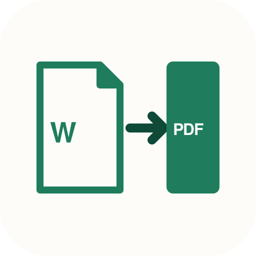

<p align="center">
  
</p>

# docx2pdf-cli

> Part of the contract-ops CLI suite. [**draft-cli**](https://github.com/DrBaher/draft-cli) (fill placeholders) → [**nda-review-cli**](https://github.com/DrBaher/nda-review-cli) (review, redline, negotiate) → **docx2pdf-cli** (DOCX → PDF) → [**sign-cli**](https://github.com/DrBaher/sign-cli) (signing + audit). Storage layer: [**template-vault-cli**](https://github.com/DrBaher/template-vault-cli). Drift detection: [**compare-cli**](https://github.com/DrBaher/compare-cli). [Showcase site](https://cli.drbaher.com/).

[](https://www.npmjs.com/package/docx2pdf-cli)
[](https://www.npmjs.com/package/docx2pdf-cli)
[](https://github.com/DrBaher/docx2pdf-cli/actions/workflows/ci.yml)
[](LICENSE)

Honest, batch-aware DOCX → PDF converter with hybrid backends. Strict-fidelity guarantees, machine-readable JSON output, and a `--doctor` probe so an agent can self-check what backends are usable before invoking. Six pluggable backends covering Linux, macOS, Windows, and Docker.

## Run this

```bash
docx2pdf --doctor
```

Tells you which backends are usable on this machine and prints a `recommendation` field — the single best next step (Docker-Gotenberg in ~30 seconds if Docker is available, otherwise LibreOffice). Once at least one backend is available:

```bash
docx2pdf contract.docx contract.pdf
```

## Where to go next

| If you are… | Start here |
|---|---|
| **A new user** evaluating the tool | [Quick start](#quick-start) below, then [Diagnostics](#diagnostics) |
| **An operator** setting up a backend | [docs/setup/](docs/setup/) — LibreOffice / Gotenberg / ConvertAPI / Pages / Word |
| **An LLM agent** driving the CLI | [AGENTS.md](AGENTS.md) → [`docx2pdf --capabilities`](#capability-discovery) → [docs/reference/](docs/reference/) |
| **A contributor** | [docs/reference/](docs/reference/) (concept docs), the npm package, the CI workflows |

Concept deep-dives live in [docs/reference/](docs/reference/); per-backend setup in [docs/setup/](docs/setup/).

## Install

```bash
npm i -g docx2pdf-cli
docx2pdf --doctor
```

You'll also need at least one backend runtime. Easiest path: LibreOffice via `brew install --cask libreoffice` (macOS) or `apt install libreoffice` (Debian/Ubuntu). Or run Gotenberg in Docker for zero system mutation. The `--doctor` JSON's `recommendation` field picks the right one for your host.

From a clone:

```bash
git clone https://github.com/DrBaher/docx2pdf-cli.git
cd docx2pdf-cli && ./install.sh
```

## Quick start

### Single file

```bash
docx2pdf contract.docx contract.pdf
```

### Batch mode (parallel, NDJSON output)

```bash
docx2pdf --concurrency 4 --json --out-dir ./pdfs ./drafts/*.docx
```

One bad file doesn't stop the rest. With `--json`, each file emits one NDJSON line plus a final summary. Exit code `0` only if every file succeeded.

### Strict fidelity (refuse silent text-only fallback)

```bash
docx2pdf --strict-fidelity contract.docx contract.pdf
```

### Pin a specific backend

```bash
docx2pdf --backend gotenberg contract.docx contract.pdf
docx2pdf --backend word contract.docx contract.pdf        # macOS only
```

### Network retries

```bash
docx2pdf --backend gotenberg --retries 3 contract.docx contract.pdf
```

Non-busy backoff via `Atomics.wait`. Advertised via `supports.retries` in `--capabilities`.

### Font preflight

```bash
docx2pdf --check-fonts contract.docx
```

Warns when fonts referenced by the document aren't installed, so you find out before LibreOffice silently substitutes them.

## Backends

Six backends, auto-selected in this order:

| Backend | Fidelity | Requires |
|---|---|---|
| `libreoffice` | high (local) | `soffice` or `lowriter` |
| `gotenberg` | high (server) | `GOTENBERG_URL` + `curl` |
| `convertapi` | high (cloud) | `CONVERTAPI_SECRET` + `curl` |
| `pages` | high (macOS) | Apple Pages + Automation permission |
| `word` | high (macOS) | Microsoft Word + Automation permission |
| `textutil-cups` | text-only | `textutil` + `cupsfilter` |

`--strict-fidelity` refuses the text-only fallback. Per-backend setup in [docs/setup/](docs/setup/); decision guidance in [docs/reference/backends.md](docs/reference/backends.md).

## Diagnostics

```bash
docx2pdf --doctor                  # full host-readiness JSON; locked by schemas/doctor.schema.json
docx2pdf --list-backends           # which backends are usable, in auto-selection order
docx2pdf --capabilities            # machine-readable feature contract; locked by schemas/capabilities.schema.json
docx2pdf --why input.docx          # print backend selection reasoning, then convert
docx2pdf --check-fonts input.docx  # report missing fonts (needs unzip + fc-list)
```

`--check-fonts` requires `unzip` and `fc-list`. On macOS: `brew install fontconfig`.

## For LLM agents

Agent affordances are first-class. The full contract is in [AGENTS.md](AGENTS.md); the schemas are in [`schemas/`](schemas/).

### Capability discovery

```bash
docx2pdf --capabilities
```

Returns a stable machine-readable contract (locked by [`schemas/capabilities.schema.json`](schemas/capabilities.schema.json)) — `capabilitySpecVersion`, tool version, backend fidelity map, supported flags, exit-code semantics, retry support. Validate against the schema rather than parsing prose.

### Recommended defaults

```bash
docx2pdf --strict-fidelity --json --out-dir ./pdfs *.docx
```

Canonical defaults manifest: [`examples/agent-defaults.json`](examples/agent-defaults.json).

### Fallback policy

Don't silently remove `--strict-fidelity` after a backend error — that can produce a text-only PDF and lose layout. Run `--doctor`, read the `recommendation` field, surface its `command` to the user with consent, then retry. Full failure → recovery table in [AGENTS.md](AGENTS.md#failure--recovery).

## How it compares

|                                 | docx2pdf-cli       | [libreoffice-convert](https://www.npmjs.com/package/libreoffice-convert) | [AlJohri/docx2pdf](https://github.com/AlJohri/docx2pdf) | [Gotenberg](https://gotenberg.dev) | [dxpdf](https://lib.rs/crates/dxpdf) |
|---------------------------------|--------------------|--------------------------------------------------------------------------|--------------------------------------------------------|------------------------------------|--------------------------------------|
| Backend approach                | hybrid (6)         | LibreOffice                                                              | MS Word automation                                     | LibreOffice (server)               | native Skia renderer                 |
| Concurrency-safe LO             | ✅ per-call profile | ❌ shared profile collision                                              | n/a                                                    | ✅                                  | n/a                                  |
| Batch CLI + NDJSON              | ✅                  | ❌ (library API only)                                                    | ❌                                                      | n/a (HTTP server)                  | ❌                                    |
| Backend transparency (`--why`)  | ✅                  | ❌                                                                        | ❌                                                      | ❌                                  | ❌                                    |
| Font preflight                  | ✅                  | ❌                                                                        | ❌                                                      | ❌                                  | ❌                                    |
| Linux + macOS + Windows         | ✅                  | ✅                                                                        | macOS + Windows only                                   | ✅ (Docker)                         | ✅                                    |
| Install                         | `npm i -g`         | `npm i`                                                                  | `pip install`                                          | Docker                             | `cargo install` / `pip`              |

Honest notes: `libreoffice-convert` is a leaner Node *library API* (we're a CLI). Gotenberg also handles HTML→PDF and scales as a server. `dxpdf` ships a custom renderer that avoids LibreOffice entirely (~100ms per doc) but is still feature-incomplete.

## All flags

```
--backend <auto|libreoffice|gotenberg|convertapi|pages|word|textutil-cups>
--strict-fidelity         refuse to fall back to text-only backend
--out-dir <dir>           write outputs to <dir>/<basename>.pdf (enables batch mode)
--concurrency <n>         run up to N conversions in parallel in batch mode (default: 1)
--retries <n>             retry failed network backends n times (default: 0)
--timeout-seconds <n>     conversion timeout (default: 120)
--overwrite, --force      replace existing output file
--quiet, -q               suppress success output
--json                    emit machine-readable JSON (NDJSON in batch mode)
--why                     print backend selection reasoning to stderr
--check-fonts             report which fonts in the .docx are missing
--list-backends           show available backends and exit
--doctor                  print full diagnostics as JSON and exit
--capabilities            print machine-readable feature contract and exit
-h, --help
-v, --version
```

## Exit codes

| Code | Meaning |
|---|---|
| `0` | Success |
| `2` | Invalid input (missing arg, bad flag) |
| `3` | No acceptable backend available (`error.kind: "NO_BACKEND"`) |
| `4` | Conversion failed |

Full envelope and stable error `kind` table in [docs/reference/exit-codes.md](docs/reference/exit-codes.md).

## License

MIT — see [LICENSE](LICENSE).

## See also

- [AGENTS.md](AGENTS.md) — the agent quickstart (output contract, exit codes, discovery, failure recovery).
- [docs/setup/](docs/setup/) — per-backend install + configuration.
- [docs/reference/](docs/reference/) — backends, doctor JSON shape, exit codes, JSON/NDJSON output.
- [llms.txt](llms.txt) — compressed agent briefing.
- [schemas/](schemas/) — formal contracts for `--capabilities` and `--doctor` output.
- [examples/agent-defaults.json](examples/agent-defaults.json) — recommended defaults manifest.
- [CHANGELOG.md](CHANGELOG.md) — what landed and when.
